# 芯来E203移植教程

- [芯来E203移植教程](#芯来e203移植教程)
  - [发布版本](#发布版本)
    - [文件夹结构](#文件夹结构)
  - [移植步骤](#移植步骤)
    - [前序步骤](#前序步骤)
    - [Vivado操作](#vivado操作)
      - [新建工程，选择芯片型号](#新建工程选择芯片型号)
      - [创建时钟IP](#创建时钟ip)
      - [修改顶层文件](#修改顶层文件)
      - [添加约束](#添加约束)
  - [验证](#验证)
    - [验证思路](#验证思路)
    - [程序编译](#程序编译)
    - [仿真验证](#仿真验证)
    - [上板验证](#上板验证)

## 发布版本
| 时间  | 版本  | 说明 |
|---|---|---|
| 2024.4.30  | v1  |  发布本文档  |
| 2025.4.21  | v2  |  修改Vivado导入工程文件目录；细化顶层文件`system.v`的内容并修改顶层的IO；给出约束文件  |
| 2025.4.21  | v3  |  修改Schematic的图片，I/O只有三个；加入Vivado仿真流程；发布完整Vivado工程  |
| 2026.4.20  | v3.1  |  修改Nuclei Studio官网下载图片，替换失效链接  |


### 文件夹结构

```plaintext
--- lecture2_0420_release
     |--- fig：本文档以及所用图片
           |--- Readme.md：本文档
     |--- hexdump-2.1.0：bin文件转换成hex文件所用工具
     |--- trans：Vivado工程
     |--- AXU3EGB_UG.pdf：所用FPGA开发板手册
     |--- ALINX_ZYNQ_MPSoC开发平台FPGA教程V1.03.pdf：FPGA开发板教程
```

## 移植步骤

### 前序步骤

注意：Vivado工程放在**全英文路径**下

**开发环境：** Vivado 2022.2
**FPGA芯片型号：** xczu3eg-sfvc784-1-i
**E203源码链接：** https://github.com/riscv-mcu/e203_hbirdv2

### Vivado操作

#### 新建工程，选择芯片型号

将源文件文件夹（路径为`e203_hbirdv2-master/rtl/e203`和`e203_hbirdv2-master/fpga/ddr200t/src`）导入工程中
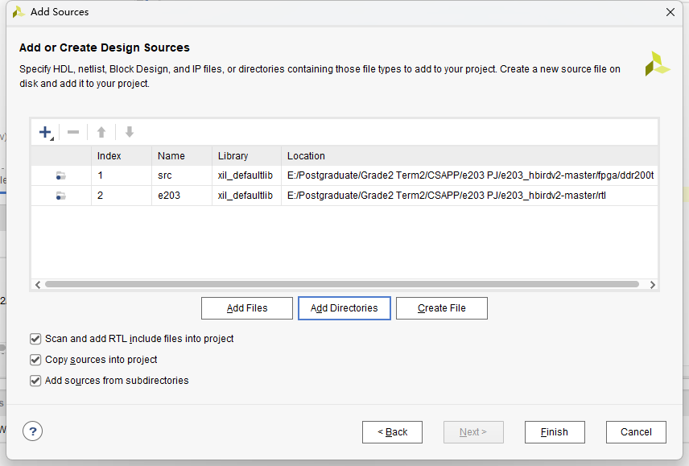

将头文件设置为global（右键然后点击`Set Global Include`），并添加一句宏定义
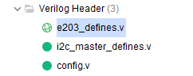
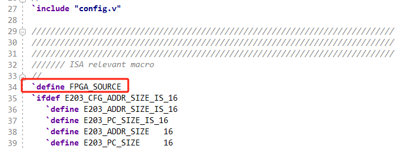

#### 创建时钟IP

选用的FPGA在PL端只有**200MHz**的差分时钟输入，所以在`system.v`内修改时钟信号
点击`IP Catalog`，搜索`Clocking Wizard`
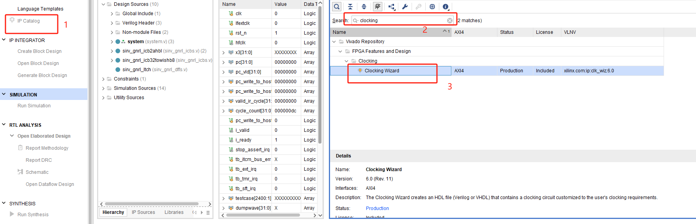

修改IP名字，与`system.v`中相对应，将输入时钟信号修改为差分信号，频率设置为200MHZ
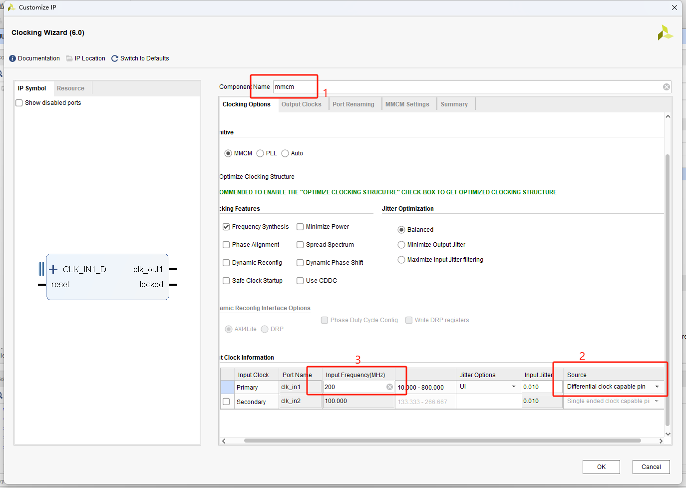

点击`Output Clocks`选项卡，将复位信号设置成低电平有效
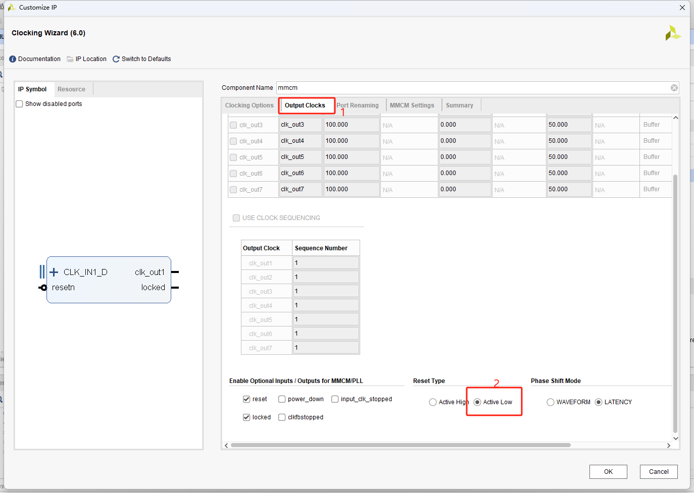

点击OK，然后保持默认，再点击OK
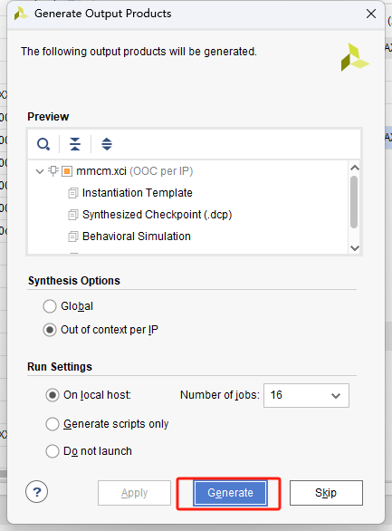

#### 修改顶层文件

将`system.v`文件设置为顶层文件`Set as Top`，将输入输出信号列表修改为如下所示，输入差分时钟信号，复位信号仅保留一个

```verilog
module system
(
input wire CLK200MHZ_P,
input wire CLK200MHZ_N,
input wire fpga_rst
);
```

调用前面例化的mmcm IP

```verilog
mmcm ip_mmcm
(
    .resetn(ck_rst),
    .clk_in1_p(CLK200MHZ_P),
    .clk_in1_n(CLK200MHZ_N),
    .clk_out1(clk_16M), 
    .locked(mmcm_locked)
);
```

原顶层文件中还需要一个**32.768KHZ**的时钟，但Clocking Wizard无法产生这么低频的时钟，所以自己写分频器实现
先添加设计文件
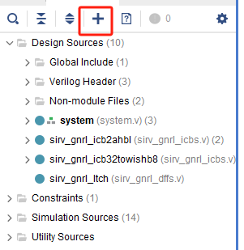
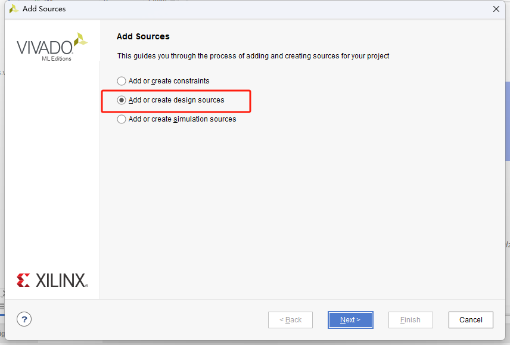
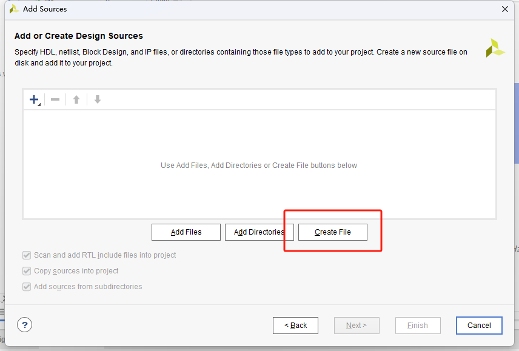
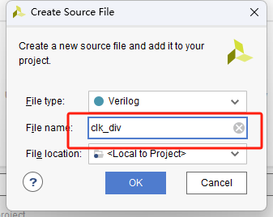

代码如下

```verilog
wire clk_16M;
wire CLK32768KHZ;
clk_div u_clk_div(
    .clk(clk_16M),
    .rst_n(ck_rst),
    .clk_div(CLK32768KHZ)
);
```

```verilog
`timescale 1ns/1ps
module clk_div(
input  clk,
input  rst_n,
output reg  clk_div
);
parameter NUM_DIV = 9'd488; //16M / 32.768K = 488.28
reg    [8:0] cnt;
always @(posedge clk or negedge rst_n)
if(!rst_n) begin
    cnt     <= 'd0;
    clk_div <= 'b0;
end
else if(cnt < NUM_DIV / 2 - 1) begin
    cnt     <= cnt + 1'b1;
    clk_div <= clk_div;
end
else begin
    cnt     <= 'd0;
    clk_div <= ~clk_div;
end
endmodule
```

删除原来复位信号的IP，修改为如下方式

```verilog
//  assign ck_rst = fpga_rst & mcu_rst;
    assign ck_rst = fpga_rst;
//  reset_sys ip_reset_sys
//  (
//    .slowest_sync_clk(clk_16M),
//    .ext_reset_in(ck_rst), // Active-low
//    .aux_reset_in(1'b1),
//    .mb_debug_sys_rst(1'b0),
//    .dcm_locked(mmcm_locked),
//    .mb_reset(),
//    .bus_struct_reset(),
//    .peripheral_reset(reset_periph),
//    .interconnect_aresetn(),
//    .peripheral_aresetn()
//  );
```

修改启动程序地址

```verilog
  // model select
  assign dut_io_pads_bootrom_n_i_ival  = 1'b0;
  assign dut_io_pads_dbgmode0_n_i_ival = 1'b1;
  assign dut_io_pads_dbgmode1_n_i_ival = 1'b1;
  assign dut_io_pads_dbgmode2_n_i_ival = 1'b1;
  //
```

然后在顶层文件`system.v`中例化的e203处理器模块**只保留如下所示的信号，其他信号全都注释或者删除**
```verilog
  e203_soc_top dut
  (
    .hfextclk(clk_16M),
    .hfxoscen(),

    .lfextclk(CLK32768KHZ), 
    .lfxoscen(),

       // Note: this is the real SoC top AON domain slow clock
    .io_pads_jtag_TCK_i_ival(),
    .io_pads_jtag_TMS_i_ival(),
    .io_pads_jtag_TDI_i_ival(),
    .io_pads_jtag_TDO_o_oval(),
    .io_pads_jtag_TDO_o_oe  (),

    .io_pads_gpioA_i_ival(),
    .io_pads_gpioA_o_oval(),
    .io_pads_gpioA_o_oe  (),

    .io_pads_gpioB_i_ival(),
    .io_pads_gpioB_o_oval(),
    .io_pads_gpioB_o_oe  (),

    .io_pads_qspi0_sck_o_oval (),
    .io_pads_qspi0_cs_0_o_oval(),

    .io_pads_qspi0_dq_0_i_ival(),
    .io_pads_qspi0_dq_0_o_oval(),
    .io_pads_qspi0_dq_0_o_oe  (),
    .io_pads_qspi0_dq_1_i_ival(),
    .io_pads_qspi0_dq_1_o_oval(),
    .io_pads_qspi0_dq_1_o_oe  (),
    .io_pads_qspi0_dq_2_i_ival(),
    .io_pads_qspi0_dq_2_o_oval(),
    .io_pads_qspi0_dq_2_o_oe  (),
    .io_pads_qspi0_dq_3_i_ival(),
    .io_pads_qspi0_dq_3_o_oval(),
    .io_pads_qspi0_dq_3_o_oe  (),


       // Note: this is the real SoC top level reset signal
    .io_pads_aon_erst_n_i_ival(ck_rst),
    .io_pads_aon_pmu_dwakeup_n_i_ival(),
    .io_pads_aon_pmu_vddpaden_o_oval(),

    .io_pads_aon_pmu_padrst_o_oval    (),

    .io_pads_bootrom_n_i_ival       (dut_io_pads_bootrom_n_i_ival),

    .io_pads_dbgmode0_n_i_ival       (dut_io_pads_dbgmode0_n_i_ival),
    .io_pads_dbgmode1_n_i_ival       (dut_io_pads_dbgmode1_n_i_ival),
    .io_pads_dbgmode2_n_i_ival       (dut_io_pads_dbgmode2_n_i_ival) 
  );
```

#### 添加约束

点击添加约束文件
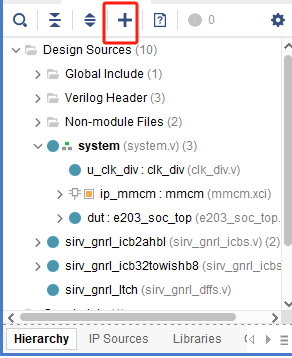
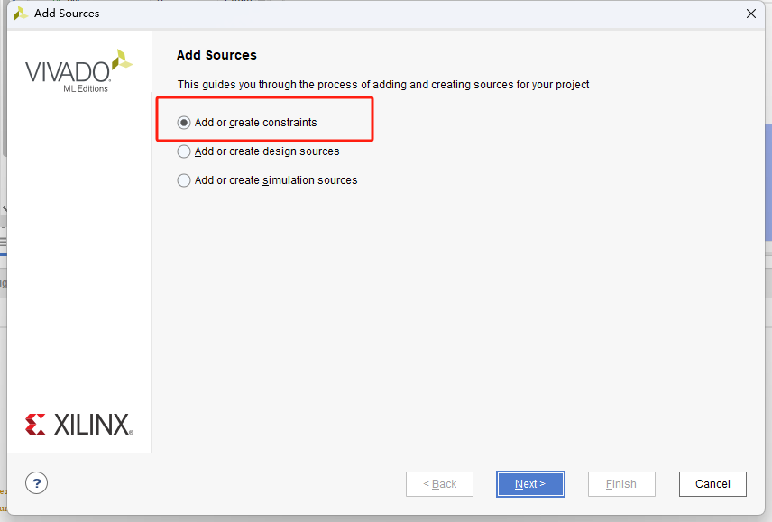

新建文件
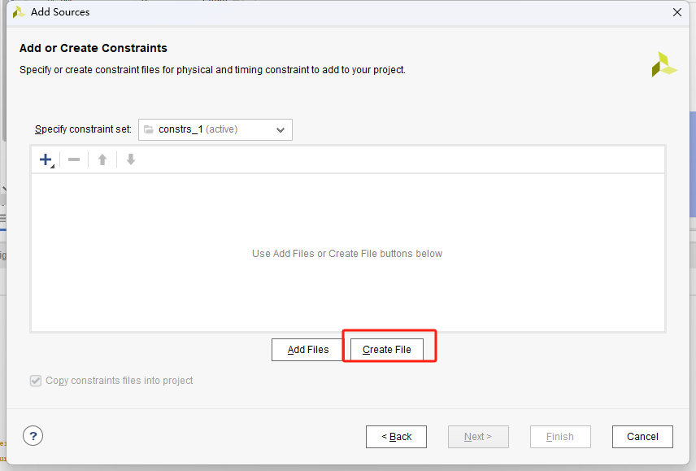
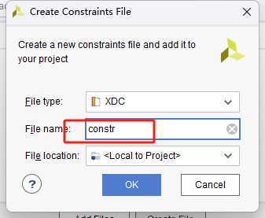

点击`RTL ANALYSIS`中的`Schematic`
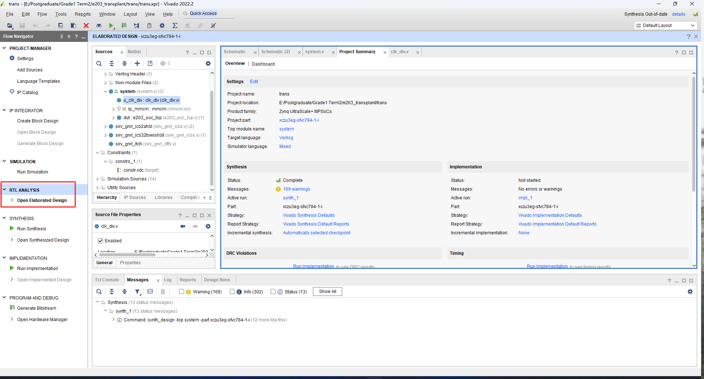

会得到一个RTL level的电路图
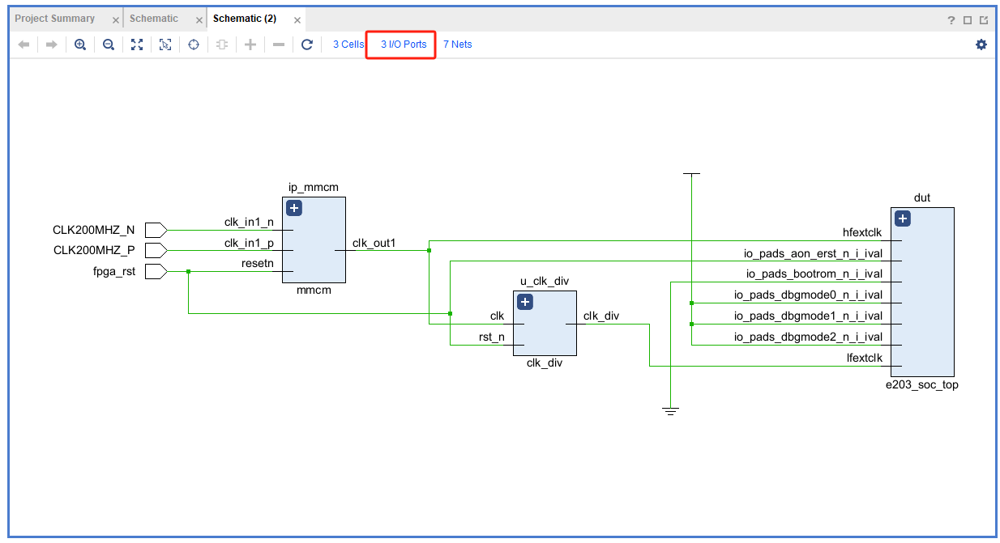

点击`I/O Ports`，在下方窗口会得到顶层IO信号列表，这里可以对IO信号进行引脚绑定和电平规范设置
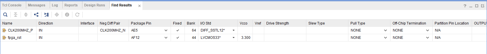

但我们采用**这个方式**，直接复制约束文件到刚刚新建的`constr.xdc`中即可

```plain text
set_property PACKAGE_PIN AE5 [get_ports CLK200MHZ_P]
set_property PACKAGE_PIN AF12 [get_ports fpga_rst]
set_property IOSTANDARD LVCMOS33 [get_ports fpga_rst]

set_property IOSTANDARD DIFF_SSTL12 [get_ports CLK200MHZ_P]
set_property IOSTANDARD DIFF_SSTL12 [get_ports CLK200MHZ_N]
```

## 验证

### 验证思路

用Nuclei Studio IDE编译程序得到可执行文件，转换成.hex导入testbench中，运行行为级仿真，在波形窗口查看程序运行状态。确认行为级仿真没有问题后综合、实现、生成比特流，烧录到FPGA板上，通过ILA抓取关键信号波形查看程序运行状态

### 程序编译

IDE下载链接：https://www.nucleisys.com/download.php
点击下载2022.12版本，下载完成后解压打开，第一次打开时要设置**工作区**，你的工程都会存在这个路径下
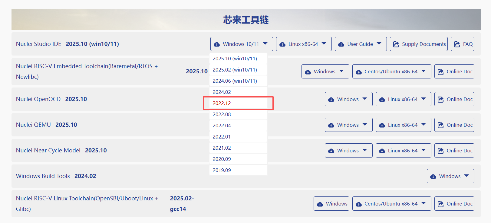

打开IDE后，点击RV-Tools
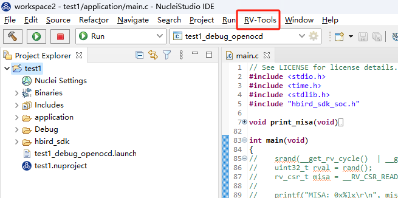

点击Nuclei Package Management，选择0.1.4版本，下载这个包
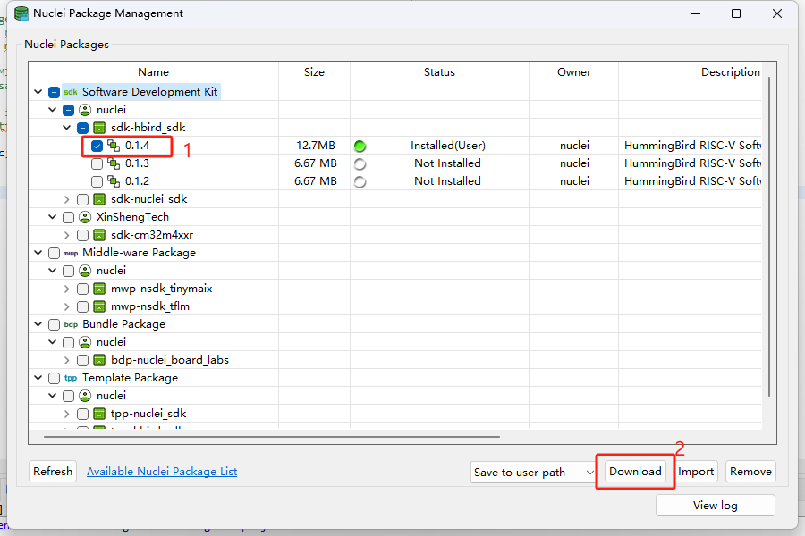

下载完成后关闭Nuclei Package Management，新建工程：点击左上角工具栏的File->New->New Nuclei RISC-V C/C++ Project，选择DDR200T这个开发板，然后进入下一步
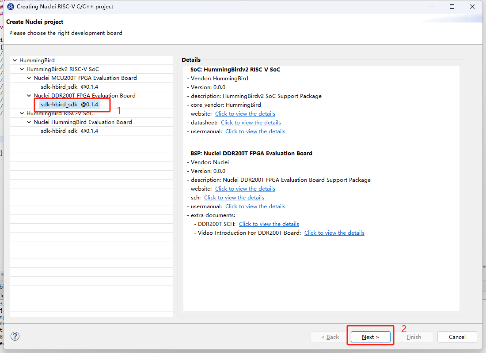

输入一个工程名字，以test1为例，选择Helloworld为工程模板，然后点击Finish
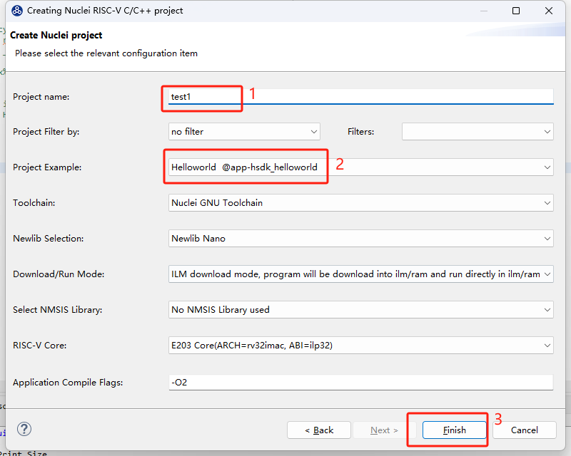

新建好的工程目录如下所示，主程序为main.c
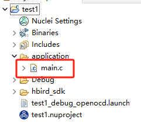

修改main函数程序，如下

```c
#include <stdio.h>
#include <time.h>
#include <stdlib.h>
#include "hbird_sdk_soc.h"
int main(void)
{
    int a, b, c;
    a = 1;
    b = 2;
    c = a + b;

    // Inline assembly to load 0xfacefeed into register r5
    asm volatile("li t0, 0xfacefeed");
    return 0;
}
```

修改设置生成.bin文件和.S文件
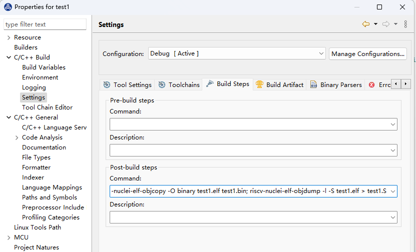

```plaintext
riscv-nuclei-elf-objcopy -O binary test1.elf test1.bin; riscv-nuclei-elf-objdump -l -S test1.elf > test1.S
```

在`工作区\test1\Debug`路径下有编译后生成的文件，列举其中几个及其作用如下

    test1.elf：通过调试器烧录的可执行文件
    test1.bin：另一种格式的可执行文件
    test1.lst：包含程序栈帧结构的反汇编文件，对于用户分析调试程序尤其有用
    test1.S：简洁的反汇编文件，一般看这个

点击编译，在下方提示框会得到编译后信息，可以看到0 errors, 0 warnings
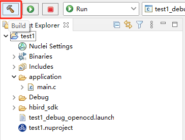
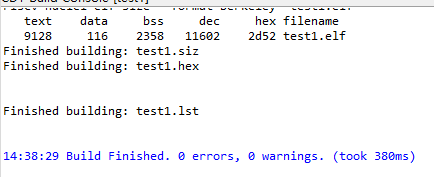

用hexdump将.bin转成.hex，导入Vivado中，具体步骤如下：
打开发布包中hexdump-2.1.0文件夹，将test1.bin复制到这个文件夹中，打开powershell运行如下命令

```powershell
.\hexdump.exe -O .\test1.bin | ForEach-Object { $_ -replace '\s+', "`n" } | Out-File -Encoding utf8 test1.hex
```

这条命令将.bin文件转成.hex文件，并且将空格转换成换行符，但windows下生成的test1.hex是UTF8 BOM格式的，需要将其转换成UTF8格式才能用函数$readmemh读取，可以用VS Code转换或者用记事本打开然后另存为
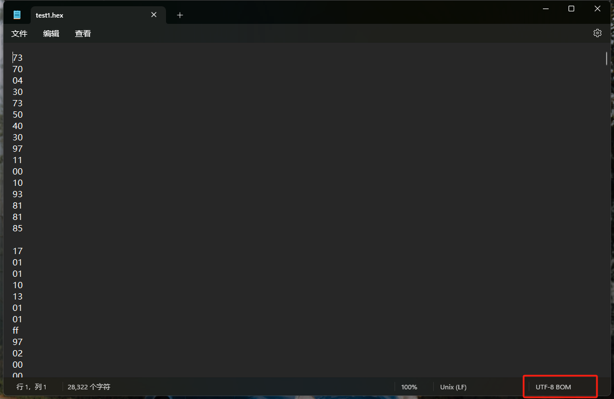
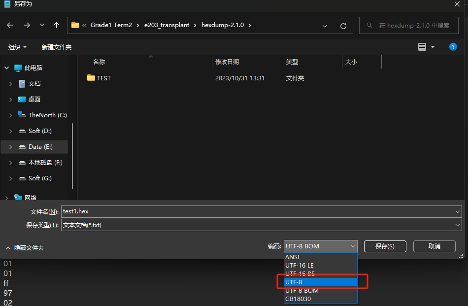
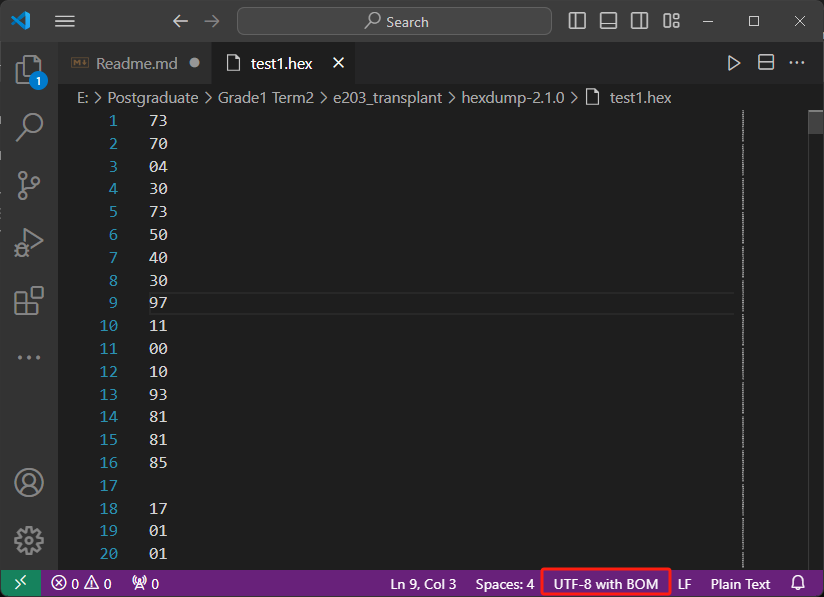
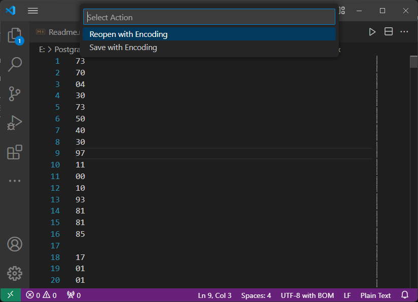
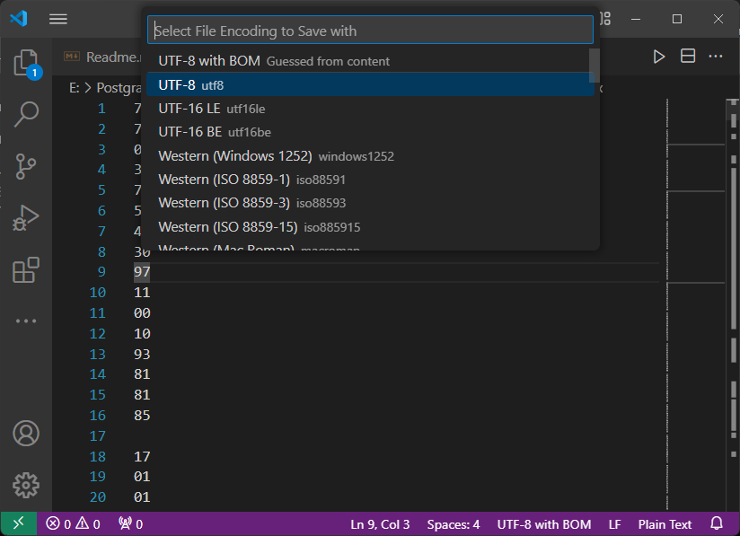

转换完成后可以在Vivado中仿真，readmemh函数可以跳过空行，所以test1.hex中存在空行不影响
由于RTL代码中ITCM存储器变量的位宽为64bit，所以通过python脚本将test1.hex再转换成test2.hex，以满足读取格式要求，
脚本位于hexdump-2.1.0\output.py，运行python环境请自行配置，python代码如下：

```python
def format_hex(input_file, output_file):
    with open(input_file, 'r') as f_input, open(output_file, 'w') as f_output:
        hex_string = ''
        for line in f_input:
            hex_string += line.strip()
        # 分割成长度为16的子字符串并以换行符连接
        formatted_line = '\n'.join(hex_string[i+14:i+16]+hex_string[i+12:i+14]+hex_string[i+10:i+12]+hex_string[i+8:i+10]+hex_string[i+6:i+8]+hex_string[i+4:i+6]+hex_string[i+2:i+4]+hex_string[i:i+2] for i in range(0, len(hex_string), 16))
        f_output.write(formatted_line + '\n')  # 每行末尾添加换行符

input_file = 'test1.hex'
output_file = 'test2.hex'
format_hex(input_file, output_file)
```

然后打开下图所示文件
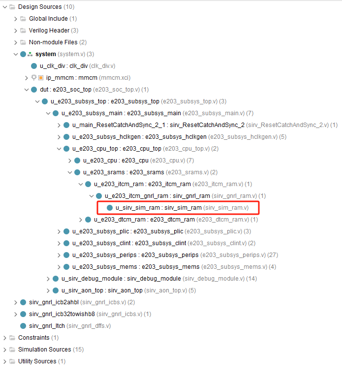

这个模块维护了ITCM（指令存储器）的内容，也就是处理器需要执行的机器码
在该模块中，添加如下代码，文件位置**自行修改**（注意：windows中路径不能有中文，要用斜杠`/`，反斜杠的话要两条`\\`）

```verilog
    initial begin
        $readmemh("E:/Postgraduate/Grade3 Term2/CSAPP/honor/lecture2_0420/hexdump-2.1.0/test2.hex", mem_r);
    end
```


### 仿真验证
在Vivado中先进行行为级仿真，在设计前期就对错误进行排查
新建testbench文件`tb.v`，并且将该文件**Set as Top**
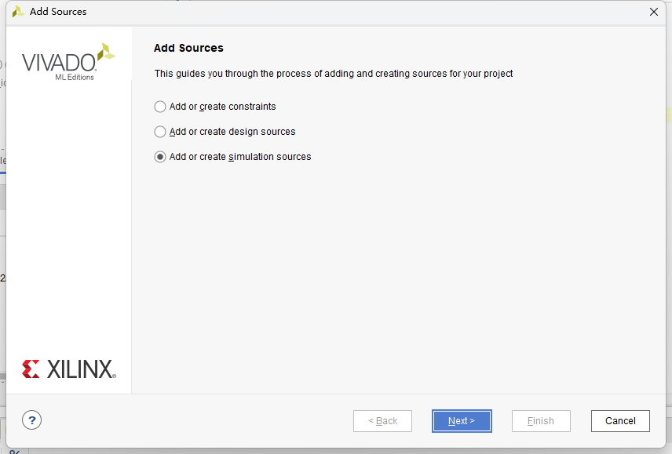
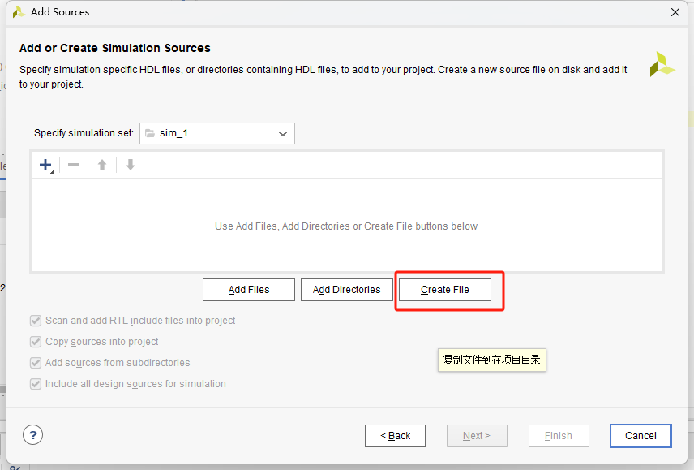
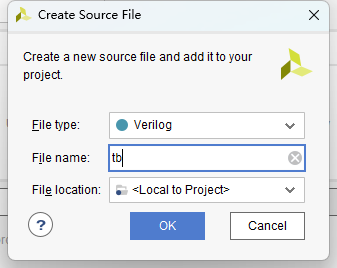

创建完成后将以下代码放到文件中
```verilog
`timescale 1ns / 1ps
module tb();
    reg clk_p, clk_n, rst_n;
    system dut(
        .CLK200MHZ_P(clk_p),
        .CLK200MHZ_N(clk_n),
        .fpga_rst(rst_n)
    );
    localparam PERIOD = 5;
    initial begin
        rst_n = 1'b0;
        clk_p = 1'b1;
        clk_n = 1'b0;
        #(PERIOD * 100) rst_n = 1'b1;
    end
    always #(PERIOD/2) clk_p = ~clk_p;
    always #(PERIOD/2) clk_n = ~clk_n;
endmodule
```
只需要产生时钟和复位信号就可以了，因为程序已经通过readmemh函数读到了ITCM中
然后点击`Run Simulation`中的`Run Behavioral Simulation`，Vivado就启动仿真器，这时候默认只跑一小段时间，所以还需要手动点击Run All
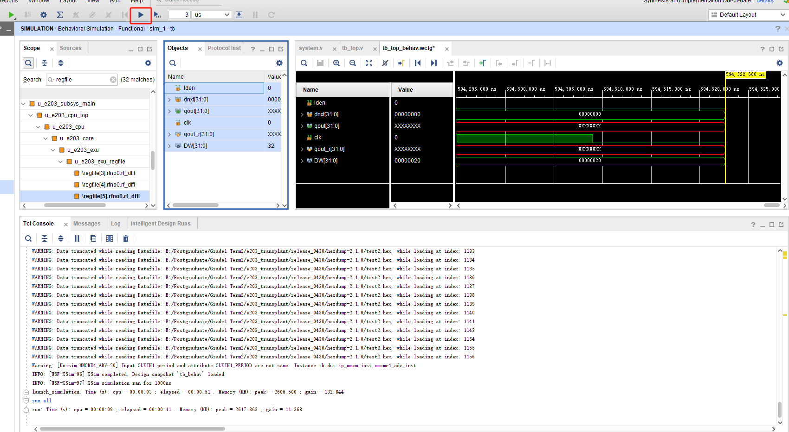
运行一长段时间后，下面的控制台窗口会打印程序信息，然后我们在左边的scope栏中，找到五号寄存器，将其中的信号都拉到波形图中，可以看到在约23ms的时刻，这个寄存器变成了`0xfacf0000`，下一个周期变成了`0xfacefeed`，说明程序运行正确
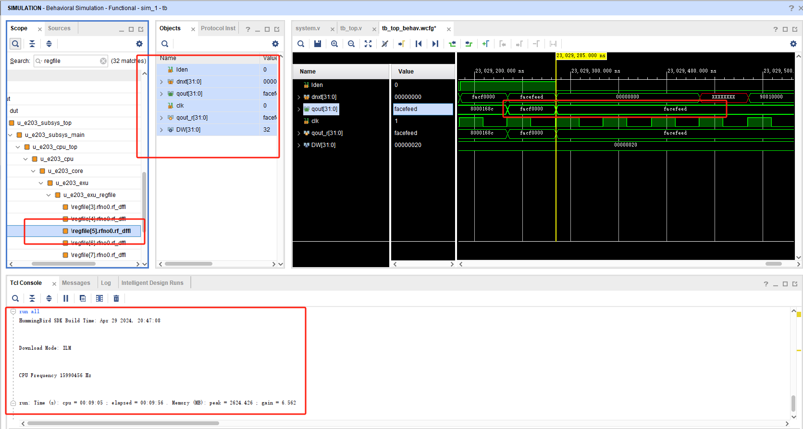
对于其他需要观测的信号，可以在其他的模块中拉进来观察

### 上板验证
为了实时捕捉处理器运行状态，我们需要一个在线/虚拟的逻辑调试仪器
Vivado中的集成逻辑分析仪（Integrated Logic Analyser，ILA）就提供了数字示波器的功能
我们首先添加ILA IP核，先点击左侧导航栏的IP Catalog，搜索ila，双击打开
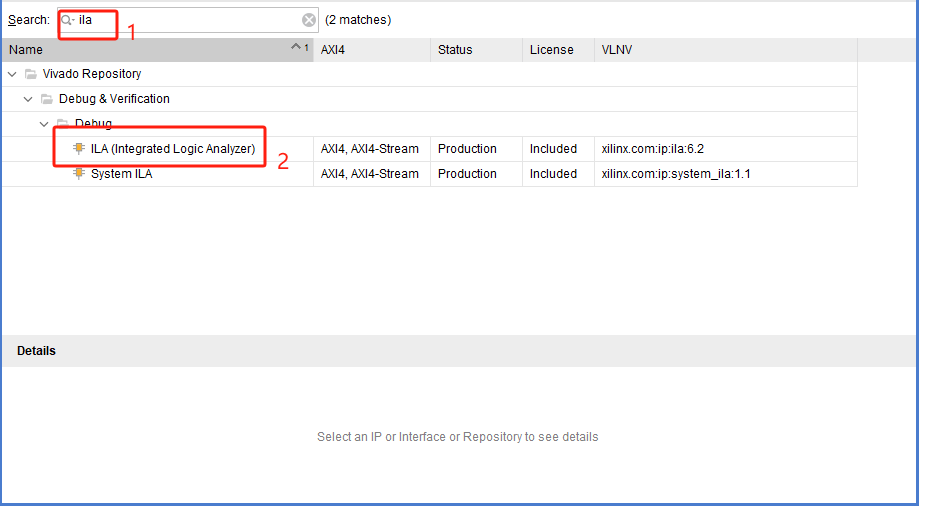

在General Options选项卡中，设置要观测的信号数量，设置观测的深度为8192
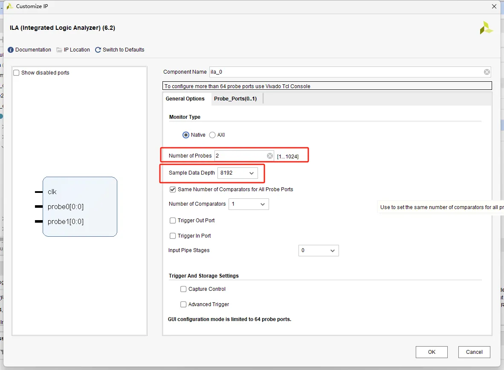

在Probe_Ports选项卡中，设置各个被观测信号的位宽，设置为32bit
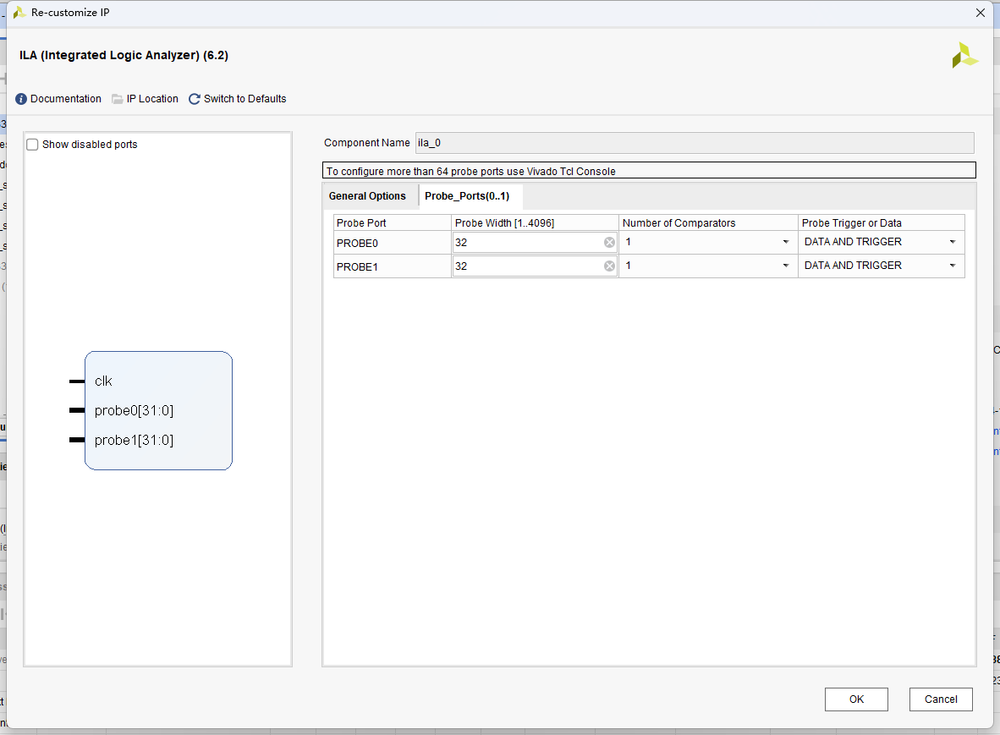

在资源栏中点击IP Sources，打开例化模板，复制右侧编辑器中的例化模板
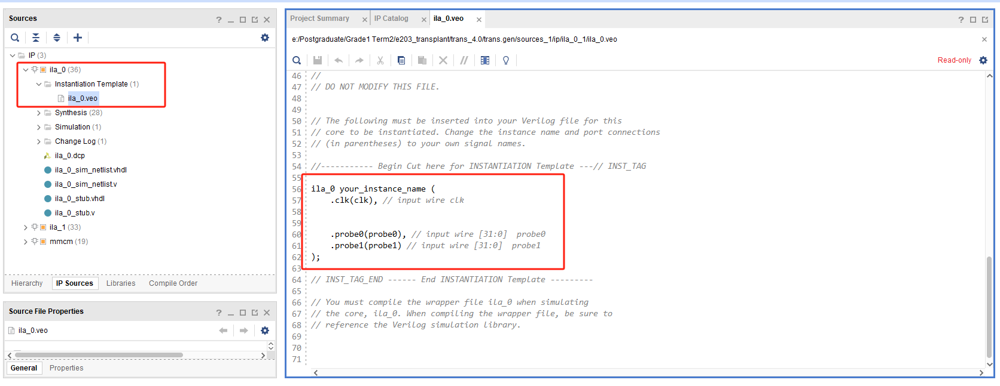

打开下图这个文件，将例化模板粘贴到其中，并修改信号名，在上板运行后可以检测程序运行状态
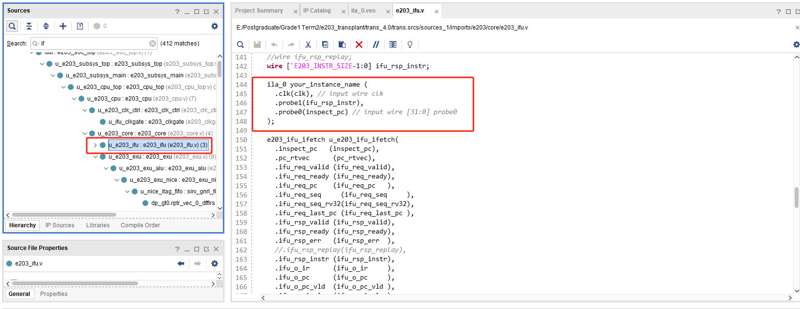

```verilog
  ila_0 your_instance_name (
    .clk(clk), // input wire clk
    .probe1(ifu_rsp_instr),
    .probe0(inspect_pc) // input wire [31:0] probe0
  );
```

在这个文件例化另一个ila，添加对通用寄存器的监测，寄存器堆位于`u_e203_exu_regfile`
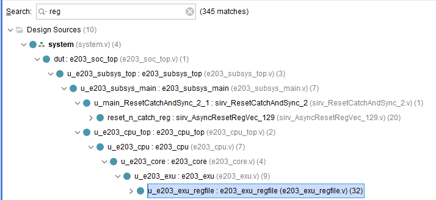

在模块中添加以下代码，例化ila，两个probe都是32 bit的，wbck_dest_dat是寄存器要写入的数据，rf_r[5]是5号寄存器每周期读出的数据，使用这个信号就可以知道指令的运行结果，即是否有修改目的寄存器的值
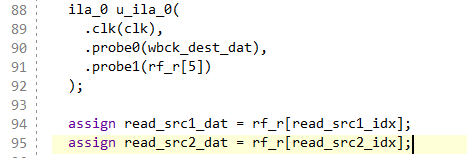

修改完成后依次进行Run Synthesis，Run Implementation，Generate Bitstream，然后打开Hardware Manager
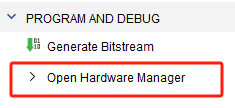

点击Program device，再点击Program
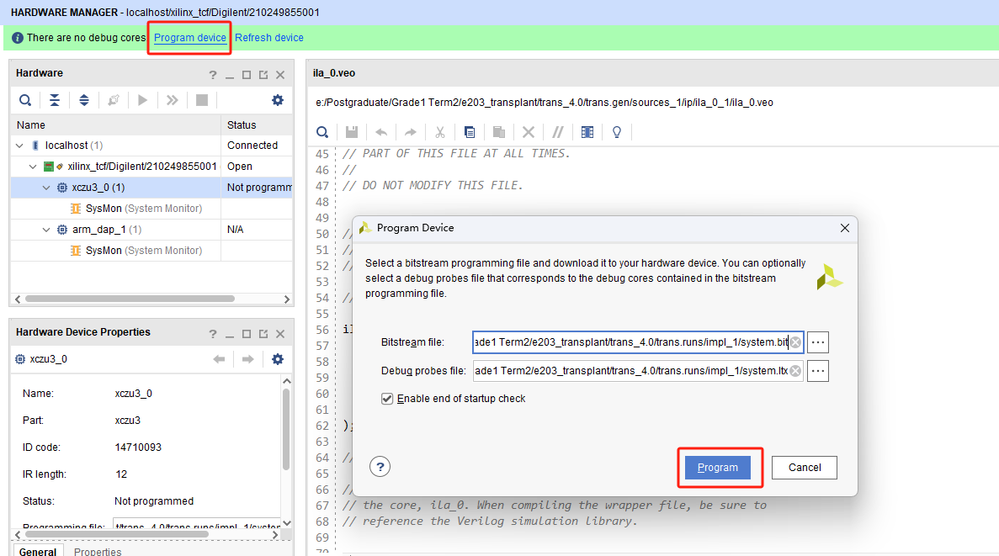

将程序下载完成后Vivado会显示ila的界面
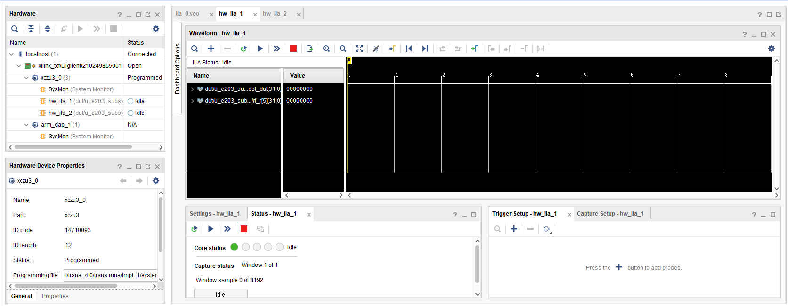

点击这个设备，然后在Properties中将ILA频率调至1000000
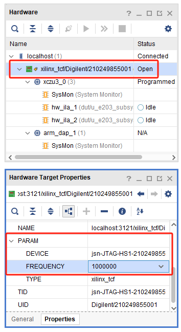

点击立即触发，可以看到5号寄存器的值是0xfacefeed，说明程序运行正确
关于ILA的详细使用可以参考这一系列视频（https://www.bilibili.com/video/BV1uG4y1q7pT/?vd_source=dc1fa7d7e43b74999c0fa8a011f2fea7）
如果不看这些视频的话只需要知道怎么设置触发条件，怎么观察信号就可以了
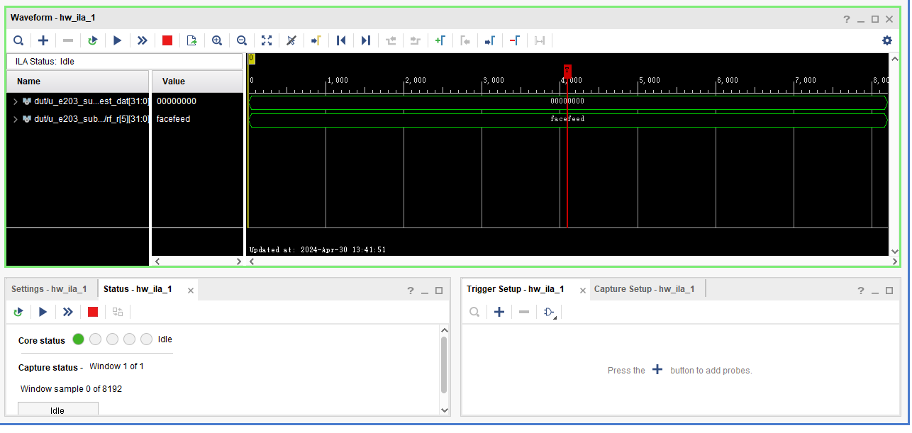

可以在右下角窗口中设置触发条件，将wbck_dest_dat设置为等于0xfacefeed时捕获，然后点击开始捕获，这时是捕获不到的，因为程序已经运行结束，按下FPGA板上的复位按键即可
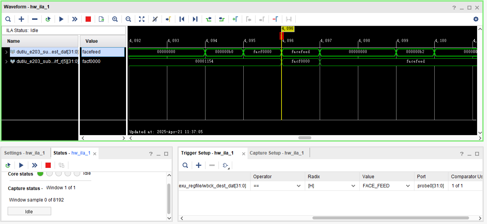